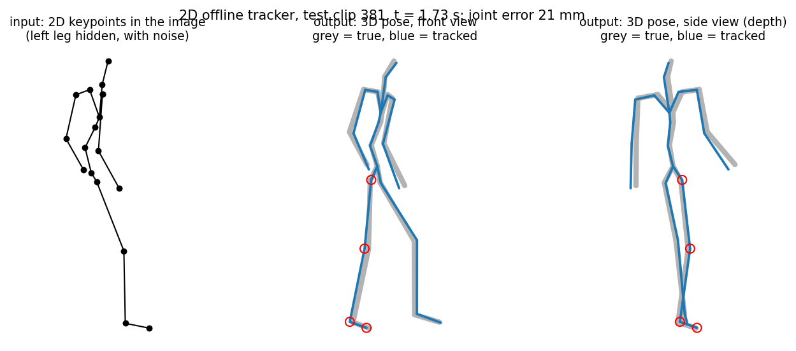
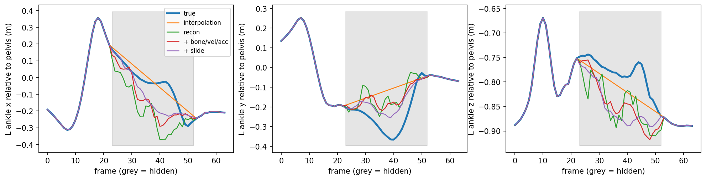

# Learning Joint Torques, Ground Reaction Forces, and Occlusion-Robust Foot Contact from 3D Human Motion

PyTorch research code and experiment artifacts for physics-aware human motion modeling with SMPL-H and AMASS. The core pipeline reconstructs articulated 3D motion from SMPL-H parameters, builds support-aware heel and toe contact labels, trains temporal contact models under severe occlusion, and uses predicted contacts to regularize root motion. The repository also preserves the completed experiment outputs for dense contact, 2D-to-3D lifting, motion reconstruction, ground reaction force estimation, inverse dynamics, balance analysis, and joint torque prediction.

## Highlights

| Experiment | Result |
| --- | ---: |
| Processed motion | 50,870 clips from 145 subjects |
| Feet-only TCN, clean input | 0.9602 F1 |
| Full-body TCN, clean input | 0.9607 F1 |
| Feet-only TCN, both feet hidden | 0.8012 F1 |
| Always-contact baseline | 0.8012 F1 |
| Full-body TCN, both feet hidden | 0.9263 F1 |
| Full-body TCN, both feet hidden, 3 seeds | 0.9279 ± 0.0013 F1 |
| Raised-stance recall, flat-floor labels | 0.5212 |
| Raised-stance recall, support-aware labels | 0.9456 |
| Root trajectory error at 25 cm drift | 13.82 cm to 2.80 cm |
| Foot sliding at 25 cm drift | 25.76 cm/s to 3.40 cm/s |
| Dense per-vertex contact, clean | 0.9631 F1 |
| Dense per-vertex contact, both feet hidden | 0.9307 F1 |
| Temporal GRF prediction, vertical RMSE | 0.075 BW |
| Temporal GRF prediction, 3D RMSE | 0.079 BW |
| Temporal ankle moment correlation | 0.923 |
| Temporal knee moment correlation | 0.917 |
| Temporal hip moment correlation | 0.974 |
| Force-plate contact comparison, all trials | 0.932 F1 |

The 25 cm drift experiment reduces mean root trajectory error by 79.7% and contact-weighted foot sliding by 86.8%.

## System overview

```text
AMASS motion parameters
        |
        v
SMPL-H forward model
shape blend shapes -> joint regression -> forward kinematics -> pose blend shapes -> skinning
        |
        v
3D joints + sole patches + body kinematics
        |
        +------------------------------+
        |                              |
        v                              v
support-aware contact labels     motion corruption
        |                       masking + noise + held frames
        +--------------+---------------+
                       |
                       v
                 Temporal ConvNet
                       |
             heel and toe contacts
                       |
        +--------------+------------------+
        |              |                  |
        v              v                  v
root correction   dense contact     physics analysis
                                     GRF + inverse dynamics
                                     joint moments + balance
```

## SMPL-H reconstruction

The body model is implemented directly from SMPL-H model tensors. The forward pass includes shape blend shapes, joint regression, a 52-joint kinematic tree, pose blend shapes, and linear blend skinning. Four sole regions are extracted near the left heel, left toe, right heel, and right toe to connect articulated motion with physical support.


## Support-aware contact labeling

A flat-floor rule misses valid contact when a person stands on a raised support. The support-aware label combines low sole speed, estimated floor evidence, and leg-extension geometry so stationary elevated support can remain contact without labeling every stationary raised foot as grounded.

Raised-stance recall increases from 0.5212 with flat-floor labels to 0.9456 with support-aware labels.


## Occlusion-robust temporal contact prediction

Each frame contains root-relative joint positions, finite-difference velocities, and visibility indicators. A 1x1 projection maps the input into a 256-channel latent representation, followed by residual temporal convolution blocks with dilations 1, 2, 4, and 8. The output predicts four contact logits per frame.

Training corruption includes random joint masking, structured lower-body occlusion, position noise, held observations, and visibility-aware velocity features.

The main ablation isolates the value of whole-body context. On clean input, the feet-only and full-body models are nearly tied. With both feet hidden for the full clip, the feet-only model falls to the always-contact baseline at 0.8012 F1 while the full-body model remains near 0.93 F1 across three seeds.


## Contact-driven root correction

Predicted contact confidence is used to regularize horizontal root motion. The refinement objective penalizes abrupt velocity changes, acceleration, and world-space foot motion during predicted support.

At 25 cm of injected drift, the tuned correction reduces root trajectory error from 13.82 cm to 2.80 cm and foot sliding from 25.76 cm/s to 3.40 cm/s.


## Dense contact

The completed dense-contact experiment predicts per-vertex foot contact instead of only four heel and toe points. The per-vertex temporal model reaches 0.9631 F1 on clean input and 0.9307 F1 when both feet are hidden. The full table is stored in `results/tables/reference/dense_contact.csv`.


## 2D-to-3D lifting and occlusion

The experiment artifacts include single-frame and temporal 2D-to-3D lifting, one-view and two-view variants, noisy 2D observations, missing joints, and hidden feet. Under both-feet-hidden input, the two-view temporal model reports 71.487 mm MPJPE with 0.856 downstream contact F1. The complete measurements are in `results/tables/reference/lifting.csv`.



## Motion reconstruction under missing joints

Reconstruction experiments compare interpolation, learned reconstruction, kinematic regularization, and foot-slide regularization under random and structured occlusion. For a fully hidden left foot, interpolation reaches 253.37 mm hidden-joint MPJPE while learned reconstruction reaches 71.81 mm. Adding bone, velocity, acceleration, and slide terms trades position error against temporal and physical consistency. Full measurements are in `results/tables/reference/reconstruction.csv`.



## Ground reaction forces and joint moments

The completed physics experiments include force allocation from motion and contact, comparison against measured force-plate contact, inverse-dynamics summaries, full-body residual diagnostics, and learned temporal prediction of GRF and lower-body joint moments.

The temporal prediction experiment reports 0.075 BW vertical GRF RMSE and 0.079 BW 3D GRF RMSE. Moment correlations are 0.923 at the ankle, 0.917 at the knee, and 0.974 at the hip. These values come directly from `results/tables/reference/torque_prediction.csv`.


Across the force-plate contact comparison, the motion-derived contact signal reaches 0.932 F1 over 144,472 frames. The corresponding per-trial values are in `results/tables/reference/contact_vs_force_plates.csv`.

## Balance and physical plausibility

Balance diagnostics measure center-of-mass position relative to the support region. Near-static clips place the center of mass inside the support region for 88.3% of supported frames and within 5 cm for 95.0%. Reconstruction experiments also track balance violation under foot occlusion. See `results/tables/reference/balance.csv` and `results/tables/reference/balance_reconstruction.csv`.

## Repository layout

```text
.
├── configs/
│   └── default.yaml
├── data/
│   ├── raw/amass/
│   ├── body_models/smplh/
│   ├── processed/
│   └── README.md
├── docs/
│   ├── compute_canada.md
│   └── experiments.md
├── results/
│   ├── checkpoints/reference/
│   ├── figures/
│   ├── figures/reference/
│   ├── tables/
│   └── tables/reference/
├── scripts/
│   ├── preprocess.py
│   ├── train.py
│   ├── evaluate_robustness.py
│   ├── refine_root.py
│   └── run_all.sh
├── src/foot_contact/
│   ├── config.py
│   ├── corruptions.py
│   ├── dataset.py
│   ├── io.py
│   ├── labels.py
│   ├── metrics.py
│   ├── model.py
│   ├── patches.py
│   ├── refinement.py
│   ├── smplh.py
│   └── training.py
├── tests/
├── LICENSE
├── NOTICE
├── Makefile
├── pyproject.toml
└── requirements.txt
```

## Setup

```bash
python -m venv .venv
source .venv/bin/activate
pip install -U pip
pip install -e .
```

AMASS and SMPL-H assets are not redistributed in this repository. Place local copies under the paths described in `data/README.md`.

## Preprocess AMASS

```bash
python scripts/preprocess.py --config configs/default.yaml
```

The preprocessing stage reconstructs SMPL-H motion, extracts sole regions, estimates floor support, generates support-aware and flat-floor labels, resamples motion to 30 Hz, and creates overlapping 64-frame clips with stride 32.

The reference preprocessing run produced 50,870 clips from 145 subjects.

The large processed tensor cache is intentionally excluded from Git. The default expected path is:

```text
data/processed/data_smplh_v2_T64_fps30.pt
```

## Train contact models

```bash
python scripts/train.py --variant mlp_full
python scripts/train.py --variant tcn_foot
python scripts/train.py --variant tcn_full_novis
python scripts/train.py --variant tcn_full
python scripts/train.py --variant tcn_full_clean
```

Seed stability runs can be reproduced by passing `--seed 1` and `--seed 2`.

## Evaluate occlusion robustness

```bash
python scripts/evaluate_robustness.py
```

## Run contact-driven root refinement

```bash
python scripts/refine_root.py
```

The tuned reference configuration uses a contact threshold of 0.8 and root velocity preservation weight of 0.01.

## Tests

```bash
pytest -q
```

The unit tests cover axis-angle rotation conversion and temporal-model tensor shapes without requiring local AMASS or SMPL-H assets.

## Reference artifacts

The uploaded completed-run artifacts are preserved under `results/*/reference/`. They include CSV metrics, figures, GIFs, and trained `.pt` files from the experimental stages. The source package contains the reproducible core contact pipeline represented in the provided project source. `docs/experiments.md` catalogs the additional completed experiment outputs without inventing implementation details that were not present in the supplied source material.

## Data licensing

AMASS and SMPL-H are external research assets with their own terms and redistribution restrictions. They are not included in this repository.

## Code license

Copyright is retained by the repository author. No permission is granted to use, copy, modify, redistribute, sublicense, sell, benchmark with, train on, or create derivative works from this code without prior written permission from the copyright holder. See `LICENSE` for the full terms.
