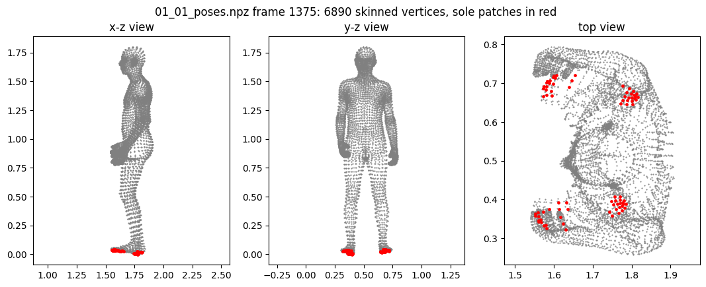
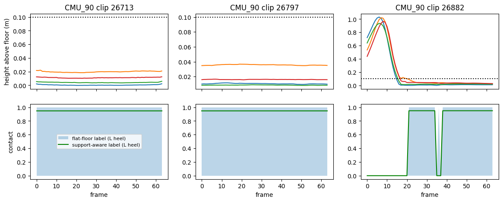
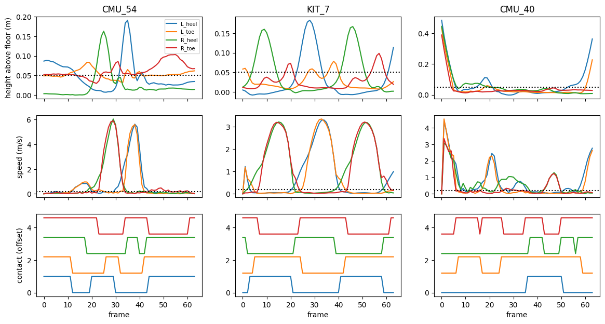
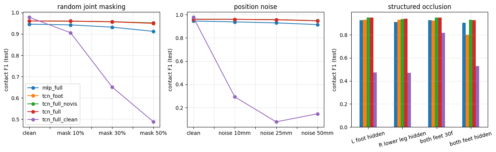
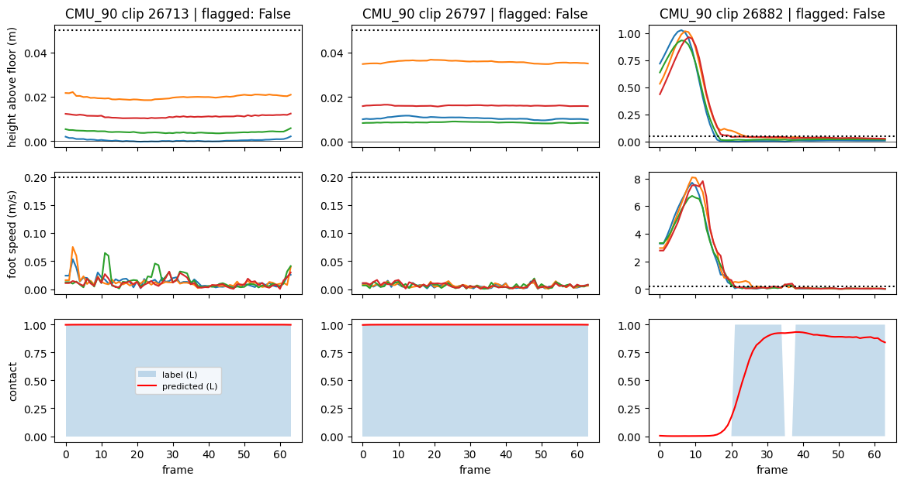
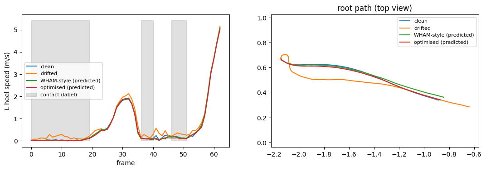
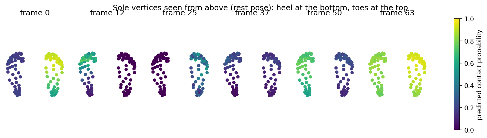

# Footwork: 3D Contact Dynamics

Footwork is a PyTorch research project for learning foot-to-ground contact from 3D human motion under severe lower-body occlusion. The pipeline reconstructs articulated motion with SMPL-H, builds support-aware heel and toe contact labels, trains temporal models on AMASS motion, and uses predicted contact to correct root drift and reduce foot sliding.

The central question is simple: when the feet disappear, can whole-body motion still tell us when and where support is happening?

## Results at a glance

| Experiment | Result |
| --- | ---: |
| Processed motion | 50,870 clips from 145 subjects |
| Feet-only TCN, clean input | 0.9602 F1 |
| Full-body TCN, clean input | 0.9607 F1 |
| Feet-only TCN, both feet hidden | 0.8012 F1 |
| Always-contact baseline | 0.8012 F1 |
| Full-body TCN, both feet hidden | 0.9263 F1 |
| Full-body TCN, both feet hidden, 3 seeds | 0.9279 ± 0.0013 F1 |
| Raised-stance recall, flat-floor labels | 0.5212 |
| Raised-stance recall, support-aware labels | 0.9456 |
| Root trajectory error at 25 cm drift | 13.82 cm to 2.80 cm |
| Foot sliding at 25 cm drift | 25.76 cm/s to 3.40 cm/s |
| Dense per-vertex contact, clean | 0.9631 F1 |
| Dense per-vertex contact, both feet hidden | 0.9307 F1 |

At 25 cm of injected drift, contact-driven correction reduces mean root trajectory error by 79.7% and contact-weighted foot sliding by 86.8%.

## What this project does

```text
AMASS motion parameters
        |
        v
SMPL-H forward model
shape blend shapes -> joint regression -> forward kinematics -> pose blend shapes -> skinning
        |
        v
3D joints + sole regions + body kinematics
        |
        +-----------------------------+
        |                             |
        v                             v
support-aware labels          synthetic corruption
heel + toe contact        masking + noise + held frames
        |                             |
        +-------------+---------------+
                      |
                      v
                Temporal ConvNet
                      |
            heel and toe contact
                      |
          +-----------+-----------+
          |                       |
          v                       v
  occlusion analysis       root correction
                           foot sliding reduction
```

## SMPL-H reconstruction

The body model is implemented directly from SMPL-H model tensors. The forward pass includes shape blend shapes, joint regression, a 52-joint kinematic tree, pose blend shapes, and linear blend skinning.

Four sole regions are extracted around the left heel, left toe, right heel, and right toe. These regions provide the geometric basis for contact labeling and motion correction.



## Support-aware foot contact labels

A fixed floor-height rule works on flat ground, but it can miss valid support when a person is standing on an elevated surface.

The support-aware labeling rule combines sole velocity, local floor evidence, and leg-extension geometry. This lets stationary elevated support remain contact without turning every stationary raised foot into a positive label.

Raised-stance recall improves from 0.5212 with the flat-floor rule to 0.9456 with support-aware labels.



A representative label sequence is shown below.



## Temporal contact prediction

Each frame uses root-relative joint positions, finite-difference velocities, and visibility indicators. A 1x1 projection maps the input into a 256-channel representation, followed by residual temporal convolution blocks with dilations 1, 2, 4, and 8. The network predicts four contact logits per frame.

Training corruption includes random joint masking, structured lower-body occlusion, position noise, held observations, and visibility-aware velocity features.

The key ablation compares a feet-only model with a full-body model.

On clean input, the two models are nearly tied at about 0.96 F1. When both feet are hidden for the full clip, the feet-only model falls to the always-contact baseline at 0.8012 F1. The full-body model remains near 0.93 F1 across three seeds.

This isolates the value of whole-body context. It contributes little when the feet are visible, but becomes important once local evidence disappears.



## Failure analysis

The project keeps subject-level and sequence-level diagnostics instead of reporting only aggregate metrics. These plots make it easier to see where the contact rule or temporal model struggles and whether an apparent improvement is concentrated in only a few clips.



## Contact-driven root correction

Predicted contact confidence is used to regularize horizontal root motion. During predicted support, the correction discourages world-space foot motion while preserving a smooth root trajectory.

At 25 cm of injected drift, the tuned correction reduces root trajectory error from 13.82 cm to 2.80 cm. Contact-weighted foot sliding drops from 25.76 cm/s to 3.40 cm/s.



## Dense foot contact

The dense-contact experiment extends the four-region representation to per-vertex foot contact. The temporal model reaches 0.9631 F1 on clean input and 0.9307 F1 when both feet are hidden.



The corresponding metrics are stored in `results/tables/reference/dense_contact.csv`.

## Why whole-body context matters

The clean-input result is intentionally not the main story. A feet-only model can solve most visible-foot frames from local kinematics alone.

The harder test is structured occlusion. Once both feet are removed, local evidence is gone. The full-body model can still use pelvis motion, leg configuration, body velocity, and temporal context to infer support state. That gap between clean and occluded evaluation is the core experiment in Footwork.

## Repository layout

```text
.
├── configs/
│   └── default.yaml
├── data/
│   ├── raw/amass/
│   ├── body_models/smplh/
│   ├── processed/
│   └── README.md
├── docs/
│   ├── compute_canada.md
│   └── experiments.md
├── results/
│   ├── checkpoints/reference/
│   ├── figures/
│   ├── figures/reference/
│   ├── tables/
│   └── tables/reference/
├── scripts/
│   ├── preprocess.py
│   ├── train.py
│   ├── evaluate_robustness.py
│   ├── refine_root.py
│   └── run_all.sh
├── src/foot_contact/
│   ├── config.py
│   ├── corruptions.py
│   ├── dataset.py
│   ├── io.py
│   ├── labels.py
│   ├── metrics.py
│   ├── model.py
│   ├── patches.py
│   ├── refinement.py
│   ├── smplh.py
│   └── training.py
├── tests/
├── LICENSE
├── NOTICE
├── Makefile
├── pyproject.toml
└── requirements.txt
```

## Setup

```bash
python -m venv .venv
source .venv/bin/activate
pip install -U pip
pip install -e .
```

On Windows Git Bash:

```bash
python -m venv .venv
source .venv/Scripts/activate
pip install -U pip
pip install -e .
```

AMASS and SMPL-H assets are not redistributed in this repository. Place local copies under the paths described in `data/README.md`.

## Preprocess AMASS

```bash
python scripts/preprocess.py --config configs/default.yaml
```

The preprocessing stage reconstructs SMPL-H motion, extracts sole regions, estimates floor support, generates support-aware and flat-floor labels, resamples motion to 30 Hz, and creates overlapping 64-frame clips with stride 32.

The reference run produced 50,870 clips from 145 subjects.

The large processed tensor cache is intentionally excluded from Git. The expected local path is:

```text
data/processed/data_smplh_v2_T64_fps30.pt
```

## Train contact models

```bash
python scripts/train.py --variant mlp_full
python scripts/train.py --variant tcn_foot
python scripts/train.py --variant tcn_full_novis
python scripts/train.py --variant tcn_full
python scripts/train.py --variant tcn_full_clean
```

Seed stability runs can be reproduced with `--seed 1` and `--seed 2`.

## Evaluate occlusion robustness

```bash
python scripts/evaluate_robustness.py
```

## Run contact-driven root refinement

```bash
python scripts/refine_root.py
```

The tuned reference configuration uses a contact threshold of 0.8 and root velocity preservation weight of 0.01.

## Tests

```bash
pytest -q
```

The tests cover axis-angle rotation conversion and temporal-model tensor shapes without requiring local AMASS or SMPL-H assets.

## Data and model assets

AMASS and SMPL-H are external research assets with their own terms and redistribution restrictions. They are not included in this repository.

Large generated dataset caches are also excluded from Git and should be created locally during preprocessing.

## License

Copyright is retained by the repository author. No permission is granted to use, copy, modify, redistribute, sublicense, sell, benchmark with, train on, or create derivative works from this code without prior written permission from the copyright holder. See `LICENSE` for the full terms.
